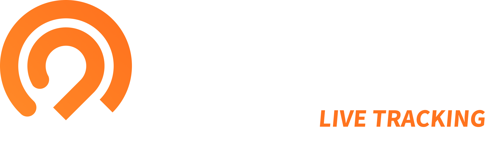

# Owaka brand-kit

This repository contains multiple logo variants for use in different design contexts or integrations.

## Variants

- **Light**: Use on light backgrounds (e.g., white, light gray).
- **Neutral**: Use on colorful or mid-tone backgrounds (e.g., blue, green, orange).
- **Dark**: Use on dark backgrounds (e.g., black, navy).

## Layouts

For each logo variant, you’ll find two layout options:
- **Wide**: Best suited for headers, websites, and presentations where space is wider.
- **Square**: Ideal for avatars, social media icons, or tight UI spaces.

## File formats

Each variant is provided in:
- `.svg`: Scalable vector format. Ideal for web, UI design, and print. Maintains perfect quality at any size and is widely supported by design tools.
- `.png`: Raster format, good for quick use or compatibility.

## Downloads

### Owaka Adventure

| Preview                                                                  | Variant                                      | Download                                                                                                                                                                                       |
|--------------------------------------------------------------------------|----------------------------------------------|------------------------------------------------------------------------------------------------------------------------------------------------------------------------------------------------|
|      | **Light – Wide** Light background         | [`owaka-adventure-logo-light-wide.svg`](./assets/owaka-adventure-logo-light-wide.svg) [`owaka-adventure-logo-light-wide.png`](./assets/owaka-adventure-logo-light-wide.png)                 |
|    | **Neutral – Wide** Mid-tone background    | [`owaka-adventure-logo-neutral-wide.svg`](./assets/owaka-adventure-logo-neutral-wide.svg) [`owaka-adventure-logo-neutral-wide.png`](./assets/owaka-adventure-logo-neutral-wide.png)         |
|       | **Dark – Wide** Dark background           | [`owaka-adventure-logo-dark-wide.svg`](./assets/owaka-adventure-logo-dark-wide.svg) [`owaka-adventure-logo-dark-wide.png`](./assets/owaka-adventure-logo-dark-wide.png)                     |

| Preview                                                                  | Variant                                      | Download                                                                                                                                                                                       |
|--------------------------------------------------------------------------|----------------------------------------------|------------------------------------------------------------------------------------------------------------------------------------------------------------------------------------------------|
|    | **Light – Square** Light background       | [`owaka-adventure-logo-light-square.svg`](./assets/owaka-adventure-logo-light-square.svg) [`owaka-adventure-logo-light-square.png`](./assets/owaka-adventure-logo-light-square.png)         |
|  | **Neutral – Square** Mid-tone background  | [`owaka-adventure-logo-neutral-square.svg`](./assets/owaka-adventure-logo-neutral-square.svg) [`owaka-adventure-logo-neutral-square.png`](./assets/owaka-adventure-logo-neutral-square.png) |
|     | **Dark – Square** Dark background         | [`owaka-adventure-logo-dark-square.svg`](./assets/owaka-adventure-logo-dark-square.svg) [`owaka-adventure-logo-dark-square.png`](./assets/owaka-adventure-logo-dark-square.png)             |

### Owaka Live Tracking

| Preview                                                             | Variant                                      | Download                                                                                                                                                                   |
|---------------------------------------------------------------------|----------------------------------------------|----------------------------------------------------------------------------------------------------------------------------------------------------------------------------|
|      | **Light – Wide** Light background         | [`owaka-live-logo-light-wide.svg`](./assets/owaka-live-logo-light-wide.svg) [`owaka-live-logo-light-wide.png`](./assets/owaka-live-logo-light-wide.png)                 |
|    | **Neutral – Wide** Mid-tone background    | [`owaka-live-logo-neutral-wide.svg`](./assets/owaka-live-logo-neutral-wide.svg) [`owaka-live-logo-neutral-wide.png`](./assets/owaka-live-logo-neutral-wide.png)         |
|       | **Dark – Wide** Dark background           | [`owaka-live-logo-dark-wide.svg`](./assets/owaka-live-logo-dark-wide.svg) [`owaka-live-logo-dark-wide.png`](./assets/owaka-live-logo-dark-wide.png)                     |

| Preview                                                             | Variant                                      | Download                                                                                                                                                                   |
|---------------------------------------------------------------------|----------------------------------------------|----------------------------------------------------------------------------------------------------------------------------------------------------------------------------|
|    | **Light – Square** Light background       | [`owaka-live-logo-light-square.svg`](./assets/owaka-live-logo-light-square.svg) [`owaka-live-logo-light-square.png`](./assets/owaka-live-logo-light-square.png)         |
|  | **Neutral – Square** Mid-tone background  | [`owaka-live-logo-neutral-square.svg`](./assets/owaka-live-logo-neutral-square.svg) [`owaka-live-logo-neutral-square.png`](./assets/owaka-live-logo-neutral-square.png) |
|     | **Dark – Square** Dark background         | [`owaka-live-logo-dark-square.svg`](./assets/owaka-live-logo-dark-square.svg) [`owaka-live-logo-dark-square.png`](./assets/owaka-live-logo-dark-square.png)             |
